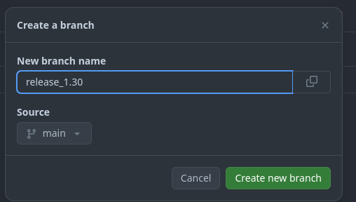
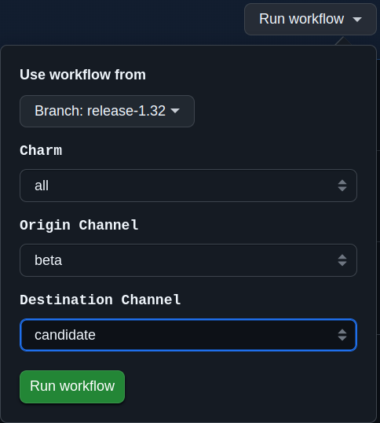
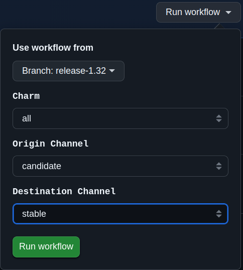

# Creating a stable release

This document outlines the process for publishing a Canonical Kubernetes stable release.

## Background

### Repository branching

This repositories used by Canonical Kubernetes has a branch scheme to provide a
consistent release experience. Any external or shared repositories are forked
into the `charmed-kubernetes` github organization and have the following branches:

* `main`: The primary development branch. Merges are made against this branch as they are approved.
* `release_1.xx`: The release branch. New major releases are branched from `main`.
* `release_1.xx`. Bug fix releases have specific commits committed to `release_1.xx` from a `bugfix_1.xx_<bugid>` branch via a pull-request.

Tags are used to mark releases on the `release_1.xx` branch.

### Feature freeze

In the weeks prior to a stable release the team goes into a feature freeze. At this
time only bugfixes and concentration on resolving any other outstanding issues
will take place for the first week of this freeze.

The remaining tasks will still be completed at the time of feature freeze giving
Solutions QA a solid base to test from.

### Conflict resolution

At the time of the feature freeze, new `release_1.xx` branches are created to match
the default repo branch per the documentation below. During the feature freeze and
Solutions QA period, fixes which need to be applied to address CI or QA failures
(and only those specific fixes) are merged to the respective release branches.

## Prepare continuous integration

### Prepare next stable release

It may feel early, but part of releasing the next stable version requires
preparing for the release that will follow. This requires opening tracks and
building relevant snaps and charms that will be used in the new `edge` channel.

Bundle/charm track requests are made by posting to the `charmhub requests` forum
asking for new tracks to be opened for `k8s` and `k8s-worker` charms. For example:

* <https://discourse.charmhub.io/t/request-new-1-30-track-for-all-charmed-k8s-charms-and-bundles/13394>

ensuring to tag the request with `k8s`, `k8s-worker`, and `canonical-kubernetes`

## Preparing the release

### Create release branches for this repo

* **URL**: <https://github.com/canonical/k8s-operator/branches>
* **New Branch**: release_1.XX
* **source**:  main

We need to create a `release_1.xx` branch from `main`.
This will be our snapshot from which we test, fix, and subsequently
promote to the new release.



### Pin snap channel in the release branches

The charms run the `k8s-snap` underneath, so to make sure the changes in the
snap are going to be available in the charm, we need to make sure the correct
k8s snap channel is referenced. For that, the [snap_installation.yaml] file
needs to be updated either with the correct `channel`, or with the `revision` of the
snap.

- Example with `channel`:

```yaml
amd64:
- install-type: store
  name: k8s
  channel: 1.32-classic/stable
  classic: true
```

- Example with `revision`:

```yaml
amd64:
- install-type: store
  name: k8s
  revision: 2500
```

The [auto-update-snap-revision] job is also responsible for auto-updating the snap
revision in the [snap_installation.yaml] file. This job is triggered on a schedule.

### Build charms from the release branches

The [publish-charms] job is responsible for publishing the charms either to the
`latest/edge` OR `<release>/beta` (e.g. `1.32/beta`) channels, depending on the
branch that is updated. If a change is merged to the `main` branch, the charm will be
published to the `latest/edge` channel. If a change is merged to a release branch,
the charm will be published to the `<release>/beta` channel.

Raising a PR, passing the integration tests, and merging into the release
branch should publish the charm to the upstream `1.xx/beta` channel.

## Internal verification

### Make sure all tests are passing

It's assumed that tests pass on the release branch. This means that the CI for PRs
on the release branch should be green before they are merged. **Certain tests might
be skipped** because they rely on a specific cloud. The list of these
tests is as follows and needs to be updated when new tests are added.
We aim to remove this list in the future, and have all tests running in CI.

- [OpenStack tests]:
  These tests should be run manually on OpenStack by the individual responsible for
  the release. In order to run them, make sure you have an active Juju controller with
  an OpenStack cloud, and run:
  ```shell
  tox run -e integration -- -k test_openstack.py --apply-proxy --model test-openstack --keep-models
  ```

Also, make sure that all the [nightly tests] are passing.

### Promote charms to candidate

**Job**: <https://github.com/canonical/k8s-operator/actions/workflows/promote_charm.yaml>

Once we've made sure that the [publish-charms] job ran successfully for the latest
changes in the release branch, and the changes are available in `beta`, we can
promote the charms to `candidate`. This can be done by running the [promote-charms] job
for the release branch:



### Notify quality team

At the end of the first week and assuming all major blockers are resolved, the
release is passed over to Solutions QA (SQA) for sign-off. This is done by
[publishing a CI release](https://github.com/charmed-kubernetes/jenkins/releases/new)
with a new `1.xx` tag and informing SQA of that tag. The SQA team will have the
remaining week to test and file bugs so engineering can work towards getting
them resolved prior to stable release.

## Performing the release

### Document release notes

* Bug fixes
* Enhancements
* Known Limitations/Issues

### Promote charms to stable

**Job**: <https://github.com/canonical/k8s-operator/actions/workflows/promote_charm.yaml>

Run the workflow from a branch, select `release_1.xx`,

* Choose `Charm` - `all`
* Choose `Origin Channel`- `candidate`
* Choose `Destination Channel` - `stable`



### Send announcement

Email announcement to k8s-crew with any relevant information.

# Fin

<!-- LINKS -->
[snap_installation.yaml]: ../../../charms/worker/k8s/templates/snap_installation.yaml
[auto-update-snap-revision]: ../../../.github/workflows/auto-update-snap-revision.yaml
[publish-charms]: ../../../.github/workflows/publish-charms.yaml
[OpenStack tests]: ../../../tests/integration/test_openstack.py
[nightly tests]: ../../../.github/workflows/nightly.yaml
