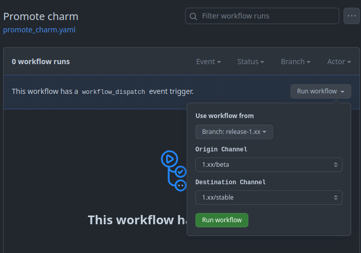

# Creating a stable release
This document outlines the process for publishing a Canonical Kubernetes stable release.

## Background

### Repository layout
This repositories used by Canonical Kubernetes has a branch scheme to provide a
consistent release experience. Any external or shared repositories are forked
into the `charmed-kubernetes` github organization and have the following branches:

* `main`: The primary development branch. Merges are made against this branch as they are approved.
* `release_1.xx`: The release branch. New major releases are branched from `main`
* `release_1.xx`. Bugfix releases have specific commits PR'd to `release_1.xx` from a `bugfix_1.xx_<bugid>` branch.

Tags are used to mark releases on the `release_1.xx` branch.

### Feature Freeze

In the weeks prior to a stable release the team goes into a feature freeze. At this
time only bugfixes and concentration on resolving any other outstanding issues
will take place for the first week of this freeze.

The remaining tasks will still be completed at the time of feature freeze giving
Solutions QA a solid base to test from.

### Conflict resolution

At the time of the feature freeze, new `release_1.xx` branches are created to match
the default repo branch per the documentation below. During the feature freeze and
Solutions QA period, fixes which need to be applied to address CI or QA failures
(and only those specific fixes) are merged to the respective release branches.

## Prepare CI

### $stable++ release

It may feel early, but part of releasing the next stable version requires
preparing for the release that will follow. This requires opening tracks and
building relevant snaps and charms that will be used in the new `edge` channel.

Bundle/charm track requests are made by posting to the `charmhub requests` forum
asking for new tracks to be opened for `k8s` and `k8s-worker` charms. For example:

- https://discourse.charmhub.io/t/request-new-1-30-track-for-all-charmed-k8s-charms-and-bundles/13394

ensuring to tag the request with `k8s`, `k8s-worker`, and `canonical-kubernetes` 

## Preparing the release

### Create release branches for this repo

* **URL**: https://github.com/canonical/k8s-operator/branches
* **New Branch**: release_1.XX
* **source**:  main

We need to create a `release_1.xx` branch from `main`. 
This will be our snapshot from which we test, fix, and subsequently 
promote to the new release.


### Pin snap channel in the release branches

We need to make sure that the charms have `1.xx/<risk>` set as the default snap channel. 

Task:
```sh
git switch release_1.xx
git checkout -b task/snap-risk/release-1.xx/<risk>
# edit the config.options.channel.default = "1.xx/<risk>"
edit charms/worker/k8s/charmcraft.yaml
edit charms/worker/charmcraft.yaml
```

Where `risk` represents the channel the most stable available risk of the snap. 

For example) `1.30-classic/beta` is the most stable shown below
```sh
⚡ snap info k8s | grep 1.30            
  1.30-classic/stable:    --                                    
  1.30-classic/candidate: --                                    
  1.30-classic/beta:      v1.30.0-beta.0 2024-03-13 (140) 107MB classic
  1.30-classic/edge:      ^                                     
```

Commit, and raise a new PR into the `release_1.xx`

### Pin pip versions of all python dependencies
In order to reproduce charm builds, we should pin the python dependencies of at least
the charm code.  The pinning should take place using a specific version of python
in order to ensure compatibility with the base os release. One can use `pyenv` to help
create python environments locally to help freeze the requirements.txt

| base                     | python |
| ---                      | ---    |
| ubuntu@20.04 (**focal**) | 3.8    |
| ubuntu@22.04 (**jammy**) | 3.10   |
| ubuntu@24.04 (**noble**) | 3.12   |

Choose the environment based build-on base in `charms/worker/k8s/charmcraft.yaml`

In the following example, building on focal yields packages for py38.
```yaml
  - build-on:
    - name: ubuntu
      channel: "20.04"
      architectures: [amd64]
```

So create a py38 environment, and freeze those libraries
Then create a PR to merge into the release branch

Task:
```sh
pyenv install 3.8
pyenv virtualenv 3.8 k8s-operator
pyenv activate k8s-operator
git switch release_1.xx
git checkout -b task/pip-pinning/release-1.xx
pip install -r charms/worker/k8s/requirements.txt
pip freeze > charms/worker/k8s/requirements.txt
```

### Build charms from the release branches

Raising a PR, passing the integration tests, and merging into the release
branch should publish the charm to the upstream `1.xx/beta` channel


## Internal verification

### Run **validate-k8s-release-upgrade** job

**Job**: https://jenkins.canonical.com/k8s-ps5/job/validate-k8s-release-upgrade/

This validates the deployment using charms from the `$prev/stable` channel,
then performing an upgrade to `1.xx/beta`. The tests are parameterized to
run on multiple series.

### Notify Solutions QA

At the end of the first week and assuming all major blockers are resolved, the
release is passed over to Solutions QA (SQA) for sign-off. This is done by
[publishing a CI release](https://github.com/charmed-kubernetes/jenkins/releases/new)
with a new `1.xx` tag and informing SQA of that tag. They will then have the
remaining week to test and file bugs so engineering can work towards getting
them resolved prior to GA.

Please note the [Conflict Resolution Section](#conflict-resolution) for making
any changes as a result of SQA testing.

### CNCF Conformance

**Job**: https://jenkins.canonical.com/k8s-ps5/job/conformance-cncf-ck/

Sync `charmed-kubernetes/k8s-conformance` main from upstream

- https://github.com/charmed-kubernetes/k8s-conformance

Confirm passing results, then create a PR against the upstream `k8s-conformance`
repo. For example, we used the following branch for CK 1.29:

- https://github.com/charmed-kubernetes/k8s-conformance/tree/1.29-ck

And opened this upstream PR:

- https://github.com/cncf/k8s-conformance/pull/3043

> **Note**: CNCF requires a sign-off. After confirming results, issue a
`git commit --amend --signoff` on the branch prior to submitting the PR.

## Performing the release

### Document release notes

- Bugfixes
- Enhancements
- Known Limitations/Issues

### Promote charms to stable
**Job**: https://github.com/canonical/k8s-operator/actions/workflows/promote_charm.yaml

Run the workflow from a branch, select `release_1.xx`, 
* Choose `Charm` - `all`
* Choose `Origin Channel`- `beta`
* Choose `Destination Channel` - `stable`



### Send announcement

Email announcement to k8s-crew with any relevant information.


# Fin